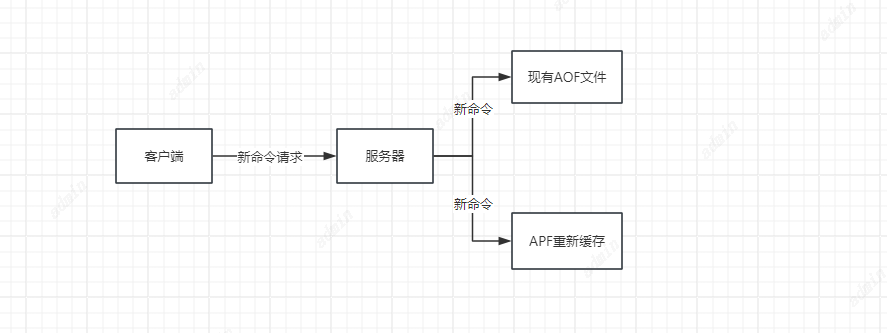

# Redis持久化
## RDB
### RDB生成触发条件
RDB是Redis生成的数据快照，会生成一个.rdb文件，生成RDB文件有以下四种情况
1. 满足配置文件中的设置
```
    秒   changes
save 5   1  //5秒内有一个数据变化
save 300 100
save 60  10000
```
2. 执行flushall
3. 执行SAVE和BGSAVE命令
在执行SAVE和BGSAVE的时候会触发快照文件生成，区别是SAVE是由主进程直接执行，BGSAVE会Fork出一个子进程进来进行快照生成。
4. Master-Replica复制的时候
### RDB使用场景
灾备恢复、定期备份

##AOF
Redis还有一个持久化方式，他会将每一个执行指令以追加的方式都写入一个.aof文件，以日志的方式保存每一个事务操作。
配置方式
```
#开启AOF持久化 
appendonly yes
# 文件名称
appendfilename="appendonly.aof"
#每个指令都写入 appendfsync always
#由系统判断何时同步 appendfsync no 
#每秒同步一次
appendfsync everysec 
```
由于AOF是采用指令追加的方式记录数据，所以.aof文件可能会特别的大，就会有以下缺点
1. AOF 文件过大会影响 Redis 的启动和关闭速度，以及数据恢复速度
2. AOF 文件过大会增加 Redis 的内存消耗和 CPU 负载，因为需要 fork 出子进程来进行持久化或者重写操作
所以Redis会重写aof文件，它可以压缩和优化 AOF 文件的内容，减少冗余和无效的命令，提高数据的存储效率和恢复速度 。
### AOF重写机制
AOF 重写机制的原理是根据 Redis 进程内的数据生成一个新的 AOF 文件，只包含当前有效和存在的数据的写入命令，而不是历史上所有的写入命令 。
**AOF 重写机制是通过 fork 出一个子进程来完成的**，子进程会扫描 Redis 的数据库，并将每个键值对转换为相应的写入命令，然后写入到一个临时文件中 。
在子进程进行 AOF 重写的过程中，主进程还会**继续接收和处理客户端的请求**，如果有新的写操作发生，主进程会将这些写操作追加到一个缓冲区中，并通过管道通知子进程 。
子进程在完成 AOF 重写后，会将缓冲区中的写操作也追加到临时文件中，然后向主进程发送信号，通知主进程可以切换到新的 AOF 文件了 。
主进程在收到子进程的信号后，会将缓冲区中的写操作再次追加到临时文件中（以防止在此期间有新的写操作发生），然后用临时文件替换旧的 AOF 文件，并关闭旧的 AOF 文件 。


### AOF重写机制触发条件
重写的触发条件有两种
1. 配置文件配置自动触发重写规则
```
#参数表示当当前 AOF 文件大小超过上次重写后 AOF 文件大小的百分比时，触发 AOF 重写机制，默认值为 100 。
auto-aof-rewriter-percentage  100
#参数表示当当前 AOF 文件大小超过指定值时，才可能触发 AOF 重写机制，默认值为 64 MB 。
auto-aof-rewriter-min-size  64mb
```
系统自动触发 AOF 重写机制还需要满足以下条件 ：
当前没有正在执行 BGSAVE 或 BGREWRITEAOF 的子进程
当前没有正在执行 SAVE 的主进程
当前没有正在进行集群切换或故障转移
2. 手动触发重写
bgrewriteaof命令


### AOF 重写机制可能遇到的问题
AOF 重写机制可能会遇到内存不足或者内存碎片化的问题 。
内存不足是指当 fork 出子进程时，操作系统会为子进程分配和主进程相同大小的内存空间，如果主进程占用的内存过大，可能导致内存不足而 fork 失败 。
内存碎片化是指当 fork 出子进程时，操作系统会使用写时复制（copy-on-write）的技术，只有当主进程修改了内存页时，才会为子进程复制一个新的内存页 。但是如果主进程使用了大页（huge page）的特性，那么每次复制的内存页也会很大，可能导致内存碎片化而 fork 失败 。
解决内存不足或者内存碎片化的问题的方法有以下几种 ：
1. 增加物理内存或者虚拟内存
2. 优化 Redis 的数据结构和编码，减少内存占用
3. 关闭大页（huge page）的特性，避免复制过大的内存页
4. 使用 Redis 4.0 及以上版本，利用 rdb-preamble 特性，将 RDB 文件写入到 AOF 文件开头，以加快数据恢复速度

## Redis混合持久化
Redis4.0以后引入了新的持久化方式——混合持久化，它结合了RDB和AOF的优点，**既能保证数据快速恢复又能保证数据的完整性，还可以减少AOF文件的大小**
混合持久化就是在AOF持久化的基础上，定期进行RDB持久化，以保证数据的快速恢复
混合持久化的实现方式是：在AOF重写时，将RDB以二进制文件压缩格式写入到AOF文件的开头，之后的数据再以AOF格式追加到文件的末尾
优点：
1. 减少AOF的大小，节省磁盘空间
2. 加快恢复的速度，避免执行大量的AOF命令
3. 避免数据丢失，双重保障
如何开启？
```
#开启 AOF 持久化
appendonly yes
#开启混合持久化
aof-use-rdb-preamble yes
#参数表示当当前 AOF 文件大小超过上次重写后 AOF 文件大小的百分比时，触发 AOF 重写机制，默认值为 100 。
auto-aof-rewriter-percentage  100
#参数表示当当前 AOF 文件大小超过指定值时，才可能触发 AOF 重写机制，默认值为 64 MB 。
auto-aof-rewriter-min-size  64mb
```
然后执行bgrewriteaof命令，执行AOF重写

注意事项（缺点）：
1. 如果RDB损坏，整个AOF都无法恢复
2. 如果AOF损坏，只能回复部分RDB数据有一部分可能丢失
3. 如果执行AOF重写时被中断，那么可能导致旧的AOF文件被覆盖或者删除，造成数据丢失
因此再使用混合持久化时，**需要定期备份AOF文件，方式数据丢失**
