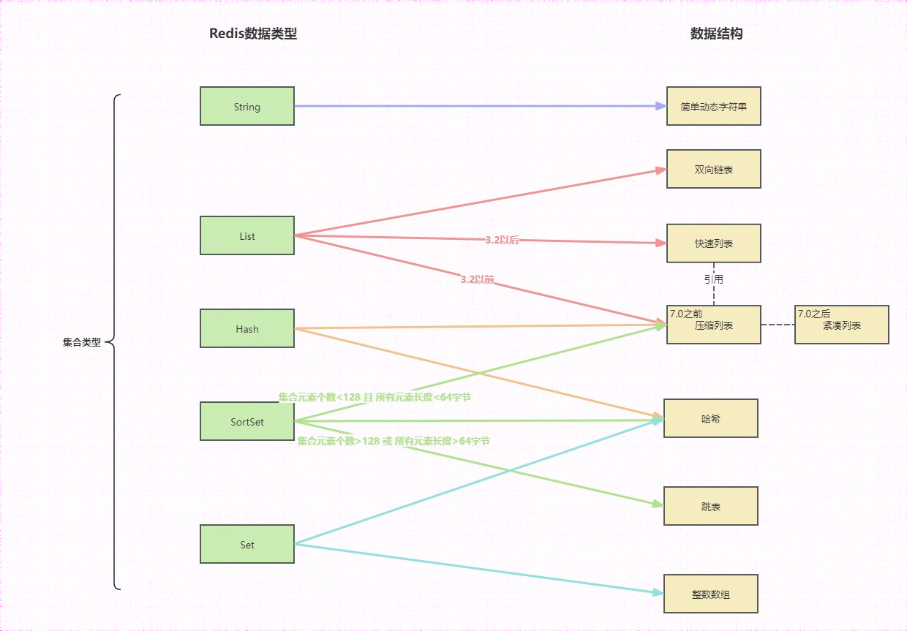

# 数据结构
数据结构是有组织的数据集合，它是一种用于存储数据以满足特定目的的独特格式。它被用于快速访问数据和简便管理数据。数据结构是一种在计算机中组织和存储数据的技术手段，以便我们能够更有效地对存储的数据进行操作。Redis复杂的数据结构使您能够用更少的代码行开发应用程序来存储，访问和使用您的数据，并启用强大而快速的内存处理。
这些数据结构避免了每次数据库操作在应用程序对象到数据库实体之间转换所带来的开销。

## Strings
Redis Strings是Redis最通用的构建块之一，是一种二进制安全的数据结构.
Strings数据类型使用的数据结构：
**SDS（简单动态字符串）**

## List

List数据结构：
**双向链表**
3.2以前**压缩列表（ZipList）**
3.2以后**快速列表（QuickList）**

## Hash
Hash数据类型的数据结构：
**哈希表**
7.0以前**压缩列表（ZipList）**
7.0以后**紧凑列表（Listpack）**

## Sets
Sets数据类型的数据结构是**哈希表**、**整数数组**

## Sorted Sets（ZSet）
Sorted Sets数据结构：
当`有序集合保存的元素数量小于128个` 且 `所有元素的长度（成员和分值的总和）小于64字节`
7.0以前使用 **压缩列表（ZipList）**
7.0以后**紧凑列表（Listpack）**
否则
使用**跳表（SkipList）**和**哈希表**

## ZipList（压缩列表）
压缩列表是一种节省空间的连续存储结构，可以减少内存碎片，压缩列表中，每个元素有两恶搞相邻节点，分别**存储元素和分数**。
### 内存使用率高
Ziplist 通过对存储的数据进行紧凑编码来减少内存使用。它不仅记录了数据的实际内容，还记录了每个元素的长度信息，使得读取时可以快速确定每个元素的边界。这样做的好处是，对于短字符串或小整数，Ziplist 可以以非常紧凑的方式存储，从而节省内存。
### 访问速度快
Ziplist 中每个元素的长度信息是显式存储的，这意味着访问特定元素时，可以直接跳转到相应的位置，无需遍历整个列表。这样，即使列表中有许多元素，访问特定元素的效率仍然很高。

但ZipList有两个问题：
1. 不能保存过多的元素，否则访问性能会下降
2. 不能保存过大的元素否则容易导致内存重新分配，甚至引起连锁更新
所以Ziplist适合小数据集、内存敏感的使用场景。
在Redis中当数据集变大会自动切换为快速列表（QuickList）或者紧凑列表（Listpack）替换。

## QuickList（快速列表）
3.0版本实现了quicklist结构，结合了链表和 ziplist 各自的优势。简单来说，一个 quicklist 就是一个双向链表，而链表中的每个元素quicklistNode又是一个 zipList。7.0以后将ziplist换成listPack。

quicklist是个节点为ziplist的双向链表，其通过控制quicklistNode结构里的压缩列表的大小或者元素个数，要是某个ziplist的元素个数多了，会采用新增节点的方法。从而来减少连锁更新带来的性能影响，但这并没有完全解决连锁更新的问题，而且因为quicklist使用节点结构指向了每个ziplist,这又增加了内存开销。
所以在Redis5.0开始加入新的数据结构Listpack，用以进一步避免ziplist连锁更新的问题。

## Listpack（紧凑列表）
紧凑列表，用一块连续的内存空间来紧凑保存数据，同时使用多种编码方式，表示不同长度的数据（字符串、整数）。**在每个listpack节点中，不再保存前一个节点的长度，所以也就不存在出现连锁更新的情况了。**
Redis7.0 才将 listpack 完整替代 ziplist。

tot-bytes： 整个结构的字节数量，包括头部以及尾部，占4个字节。
num-elements：元素的数量，占2个字节，最大表示65535个，超过则需要遍历获取长度。
entry-N：具体的每个元素。entry内结构：encoding-type、element-data、element-total-len
0xFF：结尾标志，占1个字节，全是1。

## SkipList（跳表）
本质是链表，但与链表相比增加两个逻辑
1. 元素按照升序排列存储。
2. 节点可能包含多个指针，且指针跨度不同。

传统链表只有next指针，所以只能顺序范根，如果目标元素在中间效率会很低，跳表中每个节点有多个跨度的指针，可以跳跃着查找元素，提高了效率。

# 问题
## 什么是ZipList的连锁更新
ZipList中元素个数多了，查询效率就会降低，如果在ZipList进行修改或者新增数据，ZipList占用的内存空间还需要重新分配，更糟糕的是Zip新增或者修改的时候，会导致后续元素中记录的previous_entry_length（前一元素长度）都发生变化，从而引起连锁反应，导致每个元素空间都需要重新分配，更加导致访问性能下降。

## listpack 如何避免连锁更新？
listpack是沿用了ziplist紧凑型的内存布局,一样都是为了节约内存。listpack每个列表项都只记录自己的长度，不会像 ziplist 的列表项会记录前一项的长度。所以在 listpack 中新增或修改元素，只会涉及到列表项自身的操作，不会影响后续列表项的长度变化，进而避免连锁更新。

## listpack替代了quicklist吗？
在Redis 7.0版本之前，quicklist是由双向链表和压缩列表构成的。然而，在Redis 7.0版本中，quicklist的底层实现由双向链表和压缩列表变为了由双向链表和listpack构成的结构。
这表明，虽然listpack在Redis 7.0版本中被引入并用于替代压缩列表（ziplist）的部分功能，但quicklist的结构仍然存在，只是其中的压缩列表部分被listpack所替代。因此，listpack并没有完全替代quicklist，而是作为quicklist的一部分，改变了其原有的实现方式‌

