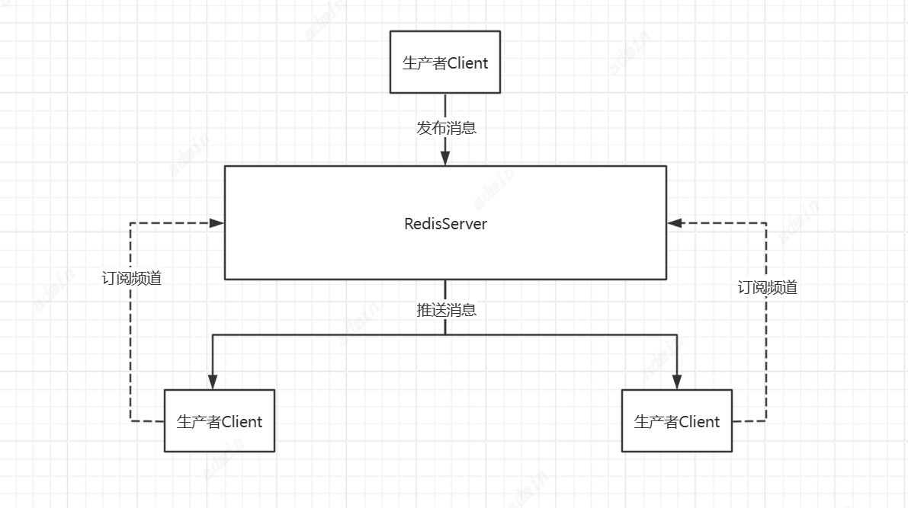

# Redis消息队列

Redis有三种方式实现消息队列功能。分别是b、List、Stream、Pub/Su

## 基于List的消息队列
Redis的List结构可以按照插入顺序排列，这样就可以作为一个异步队列(先进后出)来进行使用，生产者从从头部插入，消费这从尾部消费。


使用不同端的命令可以实现队列
1. LPUSH、RPOP 左进右出
2. RPUSH、LPOP 右进左出
```
127.0.0.1:6379> lpush list a a b c d e  
(integer) 6
127.0.0.1:6379> rpop list
“a”
127.0.0.1:6379> rpop list
“a”
127.0.0.1:6379> rpop list
“b”
```
但使用RPOP 或 LPOP 命令会有问题，那就是消费组需要写一个循环一直获取队列里的元素，这表示需要一个线程设置为while(true)来一直循环，这可能会造成资源浪费。这就会给消费者程序带来些不必要的性能损失。
所以可以进一步改成BLPOP、BRPOP 这种阻塞式读取的命令（带 B-Bloking的都是阻塞式），客户端在没有读到队列数据时，自动阻塞，直到有新的数据写入队列，再开始读取新数据。这种方式就节省了不必要的 CPU 开销。
3. LPUSH、BRPOP 左进右阻塞出
4. RPUSH、BLPOP 右进左阻塞出
   如果将BRPOP/BLPOP超时时间设置为 0 时，即可无限等待，直到弹出消息
```
127.0.0.1:6379> lpush blist a b c d
(integer) 4
127.0.0.1:6379> brpop blist 10
1) “blist”
2) “a”
127.0.0.1:6379> brpop blist 10
1) “blist”
2) “b”
127.0.0.1:6379> brpop blist 10
1) “blist”
2) “c”
127.0.0.1:6379> brpop blist 10
1) “blist”
2) “d”
127.0.0.1:6379> brpop blist 10
(nil)
(10.02s)
```
List 队列中的消息一经发送出去，便从队列里删除。如果由于网络原因消费者没有收到消息，或者消费者在处理这条消息的过程中崩溃了，就再也无法还原出这条消息。究其原因，就是缺少消息确认机制。
通常来说为了保证消息的可靠性，消息队列都会有完善的消息确认机制（Acknowledge），即消费者向队列报告消息已收到或已处理的机制。
Redis List是如何保证消息消费确认的呢？
Redis List有两个命令， **RPOPLPUSH、BRPOPLPUSH （阻塞）从一个 list 中获取消息的同时把这条消息复制到另一个 list 里（可以当做备份），而且这个过程是原子的**。
这样我们就可以先使用RPOPLPUSH、BRPOPLPUSH将消息复制出来，再在业务流程安全结束后，再删除队列元素，实现消息确认机制。


Redis List的实现的消息队列是点对点的消息模型，无法做到消息多广播的效果，这时候就需要用到Redis的 PUB/SUB发布订阅模式。

## Pub/Sub消息订阅

Pub/Sub是Redis实现的消息订阅机制，可以实现简单的聊天室等功能。Redis的哨兵模式也是使用了Redis的Pub/Sub进行主节点切换以及哨兵选举功能。

### 原理


通过SUBSCRIBE命令订阅某频道后,redis-server里维护了一个字典,字典的键就是一个个频道!,而字典的值则是一个链表,链表中保存了所有订阅这个channel的客户
端。SUBSCRIBE命令的关键,就是将客户端添加到给定chaannel的订阅链表中。

通过PUBLISH命令向订阅者发送消息,redis-server会使用给定的频道作为键,在它所维护的channel字典中查找记录了订阅这个频道的的所有客户端的链表,遍历这个链
表,将消息发布给所有订阅者。

Pub/Sub从字面上理解就是发布(Publish)与订阅(Subscribe,在Redis中,你可以设定对某一个key值进行消息发布及消息订阅,当一个key值上进行了消息发布后,所
有订阅它的客户端都会收到相应的消息。这一功能最明显的用法就是用作实时消息系统,比如普通的即时聊天,群聊等功能。
稍微复杂的场景,消息中间件MQ(RabbitMQ,KAFKA)

但Pub/Sub模式无法消费订阅前的内容，而且也无法做到重复消费。

### 常见命令


#### SUBSCRIBE
SUBSCRIBE：订阅者订阅一个或多个频道来接收对应频道推送来的消息
```
127.0.0.1:6379> subscribe news.health
Reading messages... (press Ctrl-C to quit)
1) "subscribe"
2) "news.health"
3) (integer) 1
```

```
127.0.0.1:6379> subscribe news.health news.it
Reading messages... (press Ctrl-C to quit)
1) "subscribe"
2) "news.health"
3) (integer) 1
1) "subscribe"
2) "news.it"
3) (integer) 2
```
可以一次订阅多个频道，订阅成功会返回订阅的频道名称以及当前客户端以订阅的频道数量。

#### PUBLSH
PUBLISH：针对指定频道发布消息，一次只能发布一个频道的消息

```
127.0.0.1:6379> publish news.health "hello news.health"
(integer) 2
```
一次只能发布消息给一个频道，返回接收到消息的客户端的数量

客户端会接收到
```
1) "message" //表示收到了一个消息
2) "news.health" //消息所在的频道
3) "hello news.health" //消息内容
```

#### PSUBSCRIBE
PSUBSCRIBE：按照指定模式订阅相关频道
[]:匹配括号中任意一个字符
```
127.0.0.1:6379> psubscribe news.[id]t
Reading messages... (press Ctrl-C to quit)
1) "psubscribe"
2) "news.[id]t"
3) (integer) 1
```
?:单通配符，表示匹配任意一个字符
```
127.0.0.1:6379> psubscribe news.?t
Reading messages... (press Ctrl-C to quit)
1) "psubscribe"
2) "news.?t"
3) (integer) 1
```
*:通配符，表示匹配0到任意多个字符
```
127.0.0.1:6379> psubscribe news.*
Reading messages... (press Ctrl-C to quit)
1) "psubscribe"
2) "news.*"
3) (integer) 1
```
**这个 频道 和 模式 有什么区别呢？**
频道我们可以先理解为是个 Redis 的 key 值，而模式，可以理解为是一个类似正则匹配的 Key，只是个可以匹配给定模式的频道。这样就不需要显式地去订阅多个名称了，可以通过模式订阅这种方式，一次性关注多个频道。

#### PUBSUB
PUBSUB:查看该频道的发布、订阅相关信息

channels：查看当前 Redis 系统中所有存在的频道，命令如下：
```
127.0.0.1:6379> pubsub channels
1) "news.dt"
2) "news.it"
3) "news.health"
```
numsub：查看指定频道的订阅的客户端数量，命令如下：
```
127.0.0.1:6379> pubsub numsub news.dt
1) "news.dt"
2) (integer) 1
127.0.0.1:6379> pubsub numsub news.it
1) "news.it"
2) (integer) 1
127.0.0.1:6379> pubsub numsub news.health
1) "news.health"
2) (integer) 2
```
numpat：查看通过模式进行订阅的数量，返回的是模式数量不是客户点的数量，命令如下
```
127.0.0.1:6379> pubsub numpat
(integer) 3
```
Redis 的PUB/SUB模式有个缺点，那就是消息不能持久化。随着Redis Server故障，频道里的消息可能会丢失。而且也没有ACK机制来确保消息消费的可靠性，如果一个频道没有消费者，这个频道发布的消息会直接被丢弃。

## Stream实现消息队列
Redis5.0之后实现了Stream结构，使用Stream实现的消息队列可以持久化以及主备复制功能，可以让客户端访问任何时刻的数据，并且能记住每一个客户端访问的位置，还能保证数据不丢失。
他就像是一个仅追加内容的消息链表，把所有消息内容串联起来。每一个消息都有自己的唯一ID，且消息是持久化的。

每个Stream都有自己的唯一的名称，这个名称就是的Key。在第一次进行XADD命令追加消息时时添加会自动创建。


```
#创建一个Stream并插入数据
# * 号表示服务器自动生成 ID，后面顺序跟着一堆 key/value
127.0.0.1:6379> xadd mystream * f1 v1 f2 v2 f3 v3
“1609404470049-0”  ## 生成的消息 ID，有两部分组成，毫秒时间戳-该毫秒内产生的第1条消息

# 消息ID 必须要比上个 ID 大
127.0.0.1:6379> xadd mystream 123 f4 v4  
(error) ERR The ID specified in XADD is equal or smaller than the target stream top item

# 自定义ID
127.0.0.1:6379> xadd mystream 1609404470049-1 f4 v4
“1609404470049-1”

# -表示最小值 , + 表示最大值,也可以指定最大消息ID，或最小消息ID，配合 -、+ 使用
127.0.0.1:6379> xrange mystream - +
1) 1) “1609404470049-0”
2) 1) “f1”
2) “v1”
3) “f2”
4) “v2”
5) “f3”
6) “v3”
2) 1) “1609404470049-1”
2) 1) “f4”
2) “v4”
#删除一条消息
127.0.0.1:6379> xdel mystream 1609404470049-1
(integer) 1
127.0.0.1:6379> xlen mystream
(integer) 1
# 删除整个 stream
127.0.0.1:6379> del mystream
(integer) 1
```
```
xread 以阻塞或非阻塞方式获取消息列表，指定 BLOCK 选项即表示阻塞，超时时间 0 毫秒（意味着永不超时）

# 从ID是0-0的开始读前2条
127.0.0.1:6379> xread count 2 streams mystream 0
1) 1) “mystream”
2) 1) 1) “1609405178536-0”
2) 1) “f5”
2) “v5”
2) 1) “1609405198676-0”
2) 1) “f1”
2) “v1”
3) “f2”
4) “v2”

# 阻塞的从尾部读取流，开启新的客户端xadd后发现这里就读到了,block 0 表示永久阻塞
127.0.0.1:6379> xread block 0 streams mystream $
1) 1) “mystream”
2) 1) 1) “1609408791503-0”
2) 1) “f6”
2) “v6”
   (42.37s)

可以看到，我并没有给流 mystream 传入一个常规的 ID，而是传入了一个特殊的 ID $这个特殊的 ID 意思是 XREAD 应该使用流 mystream 已经存储的最大 ID 作为最后一个 ID。以便我们仅接收从我们开始监听时间以后的新消息。这在某种程度上相似于 Unix 命令tail -f。

当然，也可以指定任意有效的 ID。

而且， XREAD 的阻塞形式还可以同时监听多个 Strema，只需要指定多个键名即可。

127.0.0.1:6379> xread block 0 streams mystream yourstream     
```
### 消费者组
xread 虽然可以扇形分发到 N 个客户端，然而，在某些问题中，我们想要做的不是向许多客户端提供相同的消息流，而是从同一流向许多客户端提供不同的消息子集。比如下图这样，三个消费者按轮训的方式去消费一个 Stream。

Redis Stream 借鉴了很多 Kafka 的设计。
1. Consumer Group：有了消费组的概念，每个消费组状态独立，互不影响，一个消费组可以有多个消费者
2. last_delivered_id ：每个消费组会有个游标 last_delivered_id 在数组之上往前移动，表示当前消费组已经消费到哪条消息了
3. pending_ids ：消费者的状态变量，作用是维护消费者的未确认的 id。pending_ids 记录了当前已经被客户端读取的消息，但是还没有 ack。如果客户端没有 ack，这个变量里面的消息 ID 会越来越多，一旦某个消息被 ack，它就开始减少。这个 pending_ids 变量在 Redis 官方被称之为 PEL，也就是 Pending Entries List，这是一个很核心的数据结构，它用来确保客户端至少消费了消息一次，而不会在网络传输的中途丢失了没处理。


   xgroup create：创建消费者组
   xgreadgroup：读取消费组中的消息
   xack：ack 掉指定消息


**Stream 不像 Kafak 那样有分区的概念，如果想实现类似分区的功能，就要在客户端使用一定的策略将消息写到不同的 Stream。**