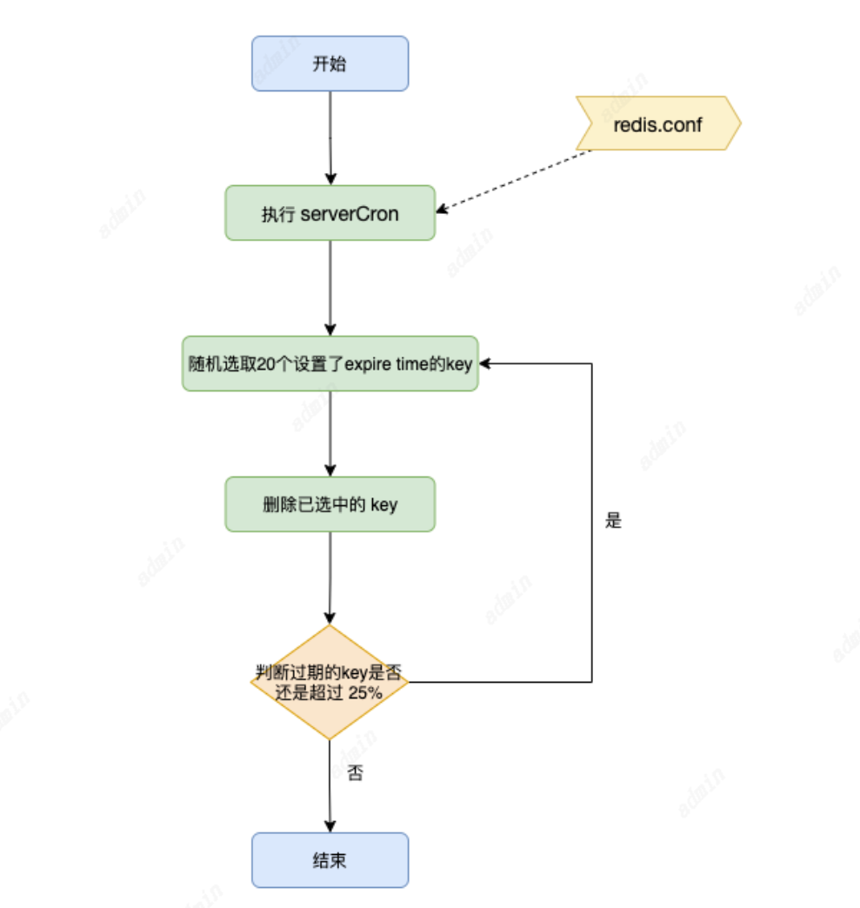
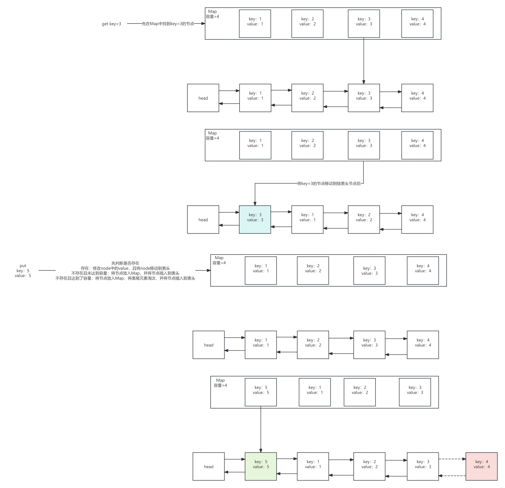
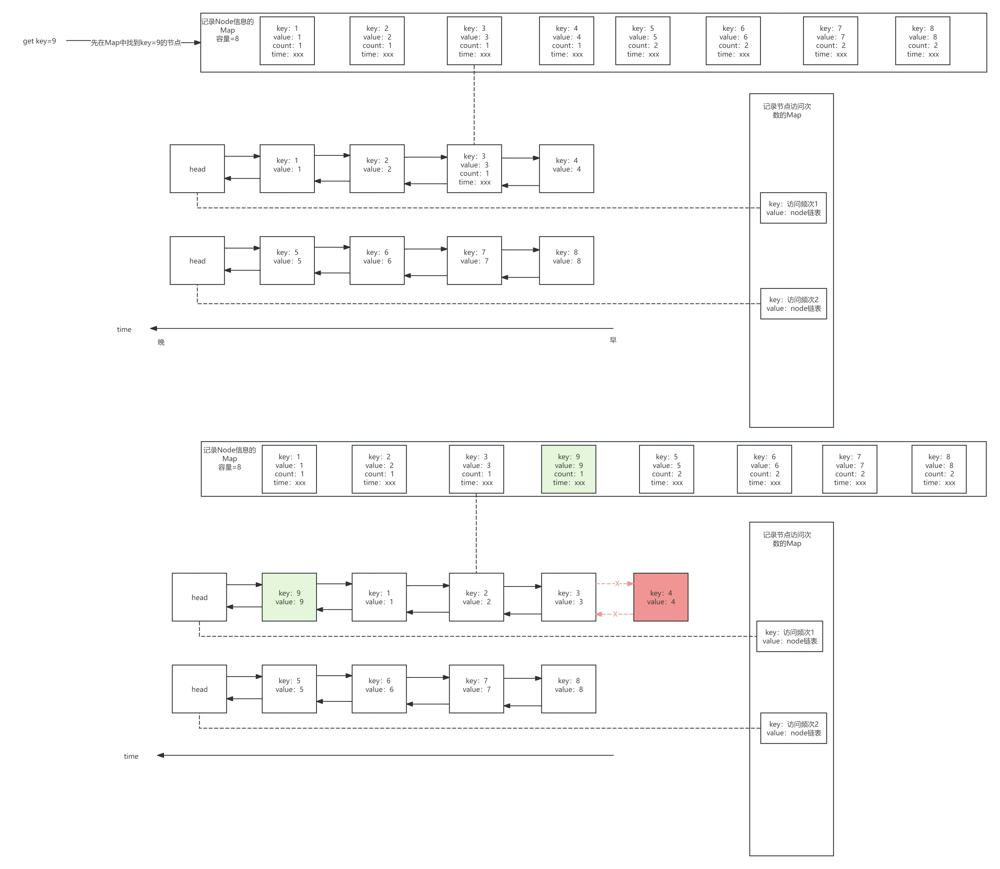

# Redis缓存删除与淘汰
## Redis的缓存删除
Redis缓存满了之后会执行缓存淘汰策略，那么缓存没满的时候，但设置了过期时间Key的缓存过期了该怎么办呢？
Redis对于过期了的Key并不是马上删除，而是通过两种方式：
1. 惰性删除
2. 通过定时任务，定期选择部分数据删除

```
# 缓存时间过期命令，参考如下
EXPIRE key seconds [ NX | XX | GT | LT] 

Redis 7.0 开始，EXPIRE 添加了 NX、XX和GT、LT 选项，分别代表如下：

NX：仅当Key没有过期时设置过期时间
XX：仅当Key已过期时设置过期时间
GT：仅当新到期时间大于当前到期时间时设置到期时间
LT：仅当新到期时间小于当前到期时间时设置到期时间
```
### 惰性删除
惰性删除就是只有当Key被请求查询时，来做检查，如果过期了就删除。
这样有个问题，内存中会存在大量过期的Key得不到释放。

### 定期删除
Redis的配置文件中有一个配置hz，用来指定多久执行一次删除操作
```
# 代表每1s 运行 10次
hz 10
```
Redis 默认每 1 秒运行 10 次，也就是每 100 ms 执行一次，每次随机抽取一些设置了过期时间的 key（这边注意不是检查所有设置过期时间的key，而是随机抽取部分），检查是否过期，如果发现过期了就直接删除。

其他注意点：
为何不扫描所有key进行过期缓存元素删除：Redis本身就是高速缓存，如果每次检查大量的key，无论在CPU和内存的的使用率上都会特别高，Redis集群越大，风险越大。
分片模式下的删除同步：无论定时删除还是惰性删除。master 会生成删除的指令记录到 AOF 和 slave 节点。

无论是惰性删除还是定期删除，都可能存在删除不尽的情况：无法删除完全，比如每次删除完过期的 key 还是超过 25%，且这些 key 再也不会被客户端访问。
如果长时间持续下去，可能会导致内存耗尽，为了避免这种糟糕情况，Redis会有一个完善的内存淘汰机制来保障。

## Redis缓存淘汰策略
Redis缓存淘汰策略有8中
noeviction：当内存不足时报错，不会淘汰任何已存在的键（默认）
volatile-ttl：删除过期时间内剩余时间最短的key
allkeys-lru：对于所有的key，淘汰最久没使用的key
volatile-lru：对于设置了过期时间的key，淘汰最久没使用的key
allkeys-random：对于所有的key，随机淘汰
volatile-random：对于所有的key，随机淘汰
allkeys-lfu：对于所有的key，淘汰使用频次最少使用的key
volatile-lfu：对于设置了过期时间的key，淘汰使用频次最少使用的key

```
# 获取当前内存淘汰策略
redis > config get maxmemory-policy

#  通过命令配置淘汰策略
redis > config set maxmemory-policy volatile-lru

# 获取Redis能使用的最大内存大小：如果不设置最大内存大小或者设置最大内存大小为0，在64位操作系统下不限制内存大小，在32位操作系统下最多使用3GB内存。
redis > config get maxmemory

# 设置Redis最大占用内存大小，这边最大占用内存大小配置为2000M
redis > config set maxmemory 2000mb
```

### LRU 最近未使用
传统的LRU是使用一个Map和一个链表，来实现的。链表内元素的顺序是按照使用时间来排序的，如使用头插法，最近使用的元素总是在表头，需要被淘汰的元素从表尾淘汰。Map的key是元素的key，value是链表的节点Node，这样可以快速根据key定位到链表的节点，从而调整链表进行元素插入、调整和淘汰。


Redis的LRU是选取几个样本Key进行对比，排除掉最久没使用的元素。因为不是在整体中进行对比和淘汰，所以这只是一个局部最优解。Redis3.0以后，算法改进为维护一个候选key池，结果更接近于理论LRU算法的结果。
这么做的目的，无非就是降低计算规模，通过概率的手段来近似达到理论的LRU效果，这对于快速响应客户端的指令以及整体的效率都是有很大益处的。
Redis支持与LRU相关淘汰策略：
1. volatile-lru 设置了过期时间的key参与近似的lru淘汰策略
2. allkeys-lru 所有的key均参与近似的lru淘汰策略
### LFU 最早最少使用(4.0之后新增的策略)
LRU有一个缺点，一批新创建的key或者偶尔才使用一次的Key，可能会把一个老的热Key淘汰掉，这明显是不符合业务预期的。
举一个极端的场景，比如在一个缓存池里维护一个定期更新的电视节目源，每个源就是一个json数据，如果按照LRU的算法根据json命中（数据更新、查看、插入等）来决定剔除哪些数据，那么在用户访问了一段时间之后，排在LRU队尾的一定是那些观众喜欢的热点电视节目，但这个时候突然来了一批新的电视节目，马上对这个缓存进行更新，之前排在队尾的用户喜欢的节目很可能就会被不断地挤压到队首甚至被剔除掉。
那么看到这里我们会想着记录key的访问次数，但是单纯的记录访问次数有两个要解决的问题：
>>在LRU算法中可以维护一个双向链表，然后简单的把被访问的节点移至链表开头，但在LFU中是不可行的，节点要严格按照计数器进行排序，新增节点或者更新节点位置时，时间复杂度可能达到O(N)。

>>只是简单的增加计数器的方法并不完美。访问模式是会频繁变化的，一段时间内频繁访问的key一段时间之后可能会很少被访问到，只增加计数器并不能体现这种趋势。
所以LFU的思路就是把访问频率高的保留，而访问频率低，虽然是近期被访问，但在LFU算法中排除的优先级会比较高，这就跟时间、次数都有关系了。

第一个问题，借鉴LRU的实现经验，维护了一个待淘汰的key的pool。第二个问题，随着时间的推移，计数器会减次数。
所以LFU就是针对这一缺点进行的改进，会根据Key的访问频次进行比较淘汰最少使用的Key。
不过，访问次数和访问频率还是有区别的，访问频率是指在一定时间的访问次数，也就是说，在计算访问频率时，**不仅仅要记录次数还要记录这些访问是在多长时间执行的**。
如A在15分钟访问了15次，B在5分钟内访问了10次，按照访问次数统计A访问次数大于B，但是按照访问频率来看B的频率大于A。

LFU算法主要分三部分，分别是：访问频率记录、键值对访问频率初始化和更新以及根据访问频率淘汰数据
LFU在LRU的基础上为每一个数据增加了一个计数器，用于统计数据的访问次数。
当使用LFU淘汰数据时，会根据数据的访问次数进行筛选，把每次访问次数最低的数据淘汰
如果两个缓存数据的访问次数相同，则会对比这两个Key最近一次的访问时间，把访问时间更早的缓存Key淘汰。


## 缓存穿透


## 缓存雪崩