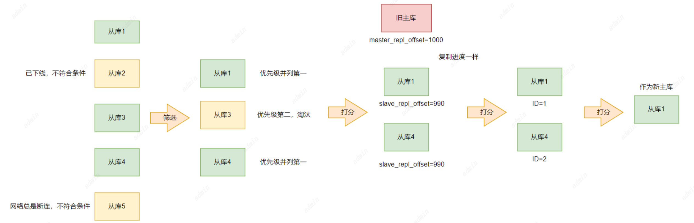
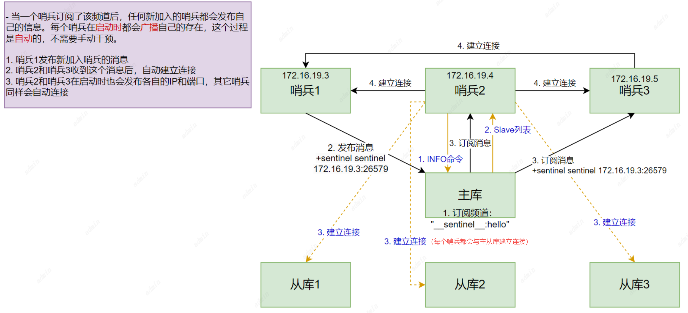

# 集群
Redis集群得模式有三种

## 主从复制
Redis主从库模式 - 保证数据副本的一致（读写分离）：
读操作：主库、从库都可以接收
写操作：首先到主库执行，然后，主库将写操作同步给从库

一个master可以有多个slave
一个slave只能有一个master
数据流向是单向的，master到slave（为什么？如果客户端对同一个数据进行多次修改，每一次的修改请求都发送到不同的实例上，在不同的实例上执行，那么这个数据在多个实例上的副本就不一致了
如果要对不同实例上的数据一致，就涉及到加锁、实例间协商是否完成修改等操作，会带来巨额的开销）

### 1、主从库间如何进行第一次同步？
当我们启动多个 Redis 实例的时候，它们相互之间就可以通过 replicaof（Redis 5.0 之前使用 slaveof）命令形成主库和从库的关系，之后会按照三个阶段完成数据的第一次同步。

主从库建立连接、协商同步，为全量复制做准备
```replicaof 172.16.19.3 6379```
从库和主库建立连接，并告诉主库即将进行同步，主库确认回复后，主从库间开始同步
主库将所有数据同步给从库。从库收到数据后，在本地完成数据加载 - **依赖于内存快照生成的RDB文件**
从库接收到RDB文件后，会先清空当前数据库 - 从库在通过replicaof命令开始和主库同步前，可能保存了其它数据
主库将数据同步给从库的过程中，主库不会被阻塞，仍然可以正常接收请求。为保证主从库的数据一致性，主库会在内存中用专门的 **replication buffer，记录 RDB 文件生成后收到的所有写操作**
主库把第二阶段执行过程中新收到的写命令，再发送给从库

所有的从库都是和主库连接，所有的全量复制都是和主库进行的。
### 主从级联模式分担全量复制时的主库压力
一次全量复制中，对于主库需要完成两个耗时操作：
1. 生成RDB文件 - fork操作会阻塞主线程处理正常请求
2. 传输RDB文件 - 占用主库网络带宽
至此，我们引出：“主 - 从 - 从”模式

分担主库压力
将主库生成RDB和传输RDB的压力，以级联的方式分散到从库上
部署主从集群时手动选择一个库（比如选择内存资源配置较高的从库），用于级联其它从库
在从库执行命令replicaof 所选从库IP 6379，建立主从关系

主从库间通过全量复制实现数据同步的过程，以及通过“主 - 从 - 从”模式分担主库压力
一旦主从库完成了全量复制，它们之间就会一直维护一个网络连接，主库会通过这个连接将后续陆续收到的命令操作再同步给从库，这个过程也称为基于长连接的命令传播，可以避免频繁建立连接的开销。
**风险：网络断联或阻塞**

### 主从库间网络断了怎么办？
在 Redis 2.8 之前，如果主从库在命令传播时出现了网络闪断，那么，从库就会和主库重新进行一次全量复制，开销非常大。
从 Redis 2.8 开始，网络断了之后，主从库会采用增量复制的方式继续同步。

为避免环形缓冲区造成的主从库不一致，可以调整`repl_backlog_size`参数
缓冲空间大小 = 主库写入命令速度 * 操作大小 - 主从库间网络传输命令速度 * 操作大小
在实际应用中，考虑到可能存在一些突发的请求压力，我们通常需要把这个缓冲空间扩大一倍，即 repl_backlog_size = 缓冲空间大小 * 2
也可以采用切片集群来分担单个主库的请求压力

小结： 
全量复制
1. 一个Redis实例的数据库不要太大，一个实例大小在几GB级别比较合适，可以减少RDB文件生成、传输和重新加载的开销
2. 避免多个从库同时和主库进行全量复制，给主库过大同步压力 - “主-从-从”
3. 基于长连接的命令传播
增量复制
留意repl_backlog_size配置参数
客户端
客户端只需配置主节点信息即可，从节点信息可以从主节点中获取到
主从复制是Redis高可用架构的基础，它的核心是通过一个主节点将数据同步到多个节点，实现以下几个方面
1. 多机备份：从节点保存主节点的数据副本，一旦主节点发生故障，从节点仍然可以提供部分读服务
2. 读操作负载均衡：从节点可以分担读请求，减轻主节点的压力
3. 简单的故障恢复：主节点部故障时，可以人工切换从节点为主节点

缺陷：
1. 无法自动化故障恢复：如果主节点宕机，需要手动切换到从节点，过程慢容易出错
2. 写操作无法负载均衡：所有的写请求只能由主节点处理，导致主节点成为性能瓶颈
3. 存储能力受限于单机：因为主节点负责所有写操作，存储数据的大小受制于单台服务器的容量

参考：https://www.cnblogs.com/chuchenbanban/p/18447031

## 哨兵
哨兵本质是一个特殊模式的redis进程。主从实例运行的同时，它也在运行，主要职责有：
1. 监控：判断主库是否在线
```
1. 哨兵进程在运行时，周期性的给所有的主从库发送PING命令，检测是否在线运行
2. 从库没有在规定时间内响应PING命令（超时），会被标记为”下线状态“
3. 主库对PING命令响应超时，判定主库下线，并自动启动切换主库的流程
```
2. 选主：决定将哪个从库升级为主库
```
主库被判定下线后，哨兵会从多个从库中，按照一定规则（优先级、复制进度、ID 号大小再对剩余的从库进行打分）选择一个打分最高的从库作为新的主库
选举新主库的规则如下：
1. 根据在线状态和网络连接状态进行筛选
   1. 在线状态
   2. 网络连接状态
      配置项down-after-milliseconds * 10 
      down-after-milliseconds：认定主从库断连的最大连接超时时间
      如果在 down-after-milliseconds 毫秒内，主从节点都没有通过网络联系上，就可以认为主从节点断连了，发生断连的次数超过10次，这个从库的网络状况不好，不适合作为新主库
2. 领导者节点会对筛选后的所有其他的从库进行投票。
   第一轮：优先级最高的从库得分高。（用户可以通过 slave-priority 配置项，给不同的资源配置的从库设置不同优先级。）
   如果从库的优先级都一样，那么哨兵开始第二轮打分。
   第二轮：和旧主库同步程度最接近的从库得分高。
   （如何判断从库和旧主库间的同步进度呢？
   主从库同步时有个命令传播的过程。在这个过程中，主库会用
master_repl_offset 记录当前的最新写操作在 repl_backlog_buffer 中的位置，而从库会
用 slave_repl_offset 这个值记录当前的复制进度。从库的 slave_repl_offset 最接近 master_repl_offset，那么它的得分就
最高，可以作为新主库。）
   如果复制进度也有相同的从库，那么进行第三轮判断。
   第三轮：每个实例都会有一个 ID，这个 ID 就类似于这里的从库的编号。目前，Redis 在选主库时，有一个默认的规定：在优先级和复制进度都相同的情况下，ID 号最小的从库得分最高，会被选为新主库。
```


3， 通知：
1. 把新主库的连接信息发给其它从库，执行`replicaof`命令，和新主库建立连接，并进行数据复制
2. 把新主库的连接信息通知给客户端，让它们把请求操作发到新主库

### 主观下线与客观下线
主库：特别注意哨兵误判的情况 - 主库实际没有下线，哨兵误以为下线了
```
一般发生在集群网络压力较大、网络拥塞，或主库本身压力较大的情况
避免后续没有价值的开销
```
解决方案：
多实例组成的集群模式进行部署 - 哨兵集群
引入多个哨兵实例一起判断，降低误判率
只有大多数哨兵实例都判断主库已经“主观下线”，主库才会被标记为“客观下线”

当有 N 个哨兵实例时，最好要有 N/2 + 1 个实例判断主库为“主观下线”，才能最终判定主库为“客观下线”
有多少个实例做出“主观下线”的判断才可以 - 可以由 Redis 管理员自行设定
总结


### 哨兵集群
只有一个哨兵依然存在高可用问题，一旦哨兵挂了，就无法进行主从切换了。
多个实例组成哨兵集群，即使哨兵实例出现故障，其他哨兵实例还是可以协作完成主从库切换（监控、选主、通知）。

#### 基于pub/sub消息订阅机制的哨兵集群组成

哨兵可以从主库上订阅消息，获得其他哨兵发布的连接信息
除了哨兵实例，用户编写的程序也可以通过Redis进行消息的发布和订阅
哨兵除了彼此间建立连接形成集群，还需要和从库建立连接
在哨兵的监控任务中，需要对主从库都进行心跳判断，而且在主从库切换完成后，需要通知从库，让它们和新主库同步
主从库切换后，客户端也需要知道新主库的连接信息，才能向新主库发送请求操作
哨兵还需要把新主库的信息告诉客户端
客户端需要获取到哨兵集群在监控、选主、切换这个过程中发生的各种事件


#### 哨兵集群选举执行主从切换的哨兵实例
在哨兵集群中，只有一个哨兵实例可以执行主从切换过程，于是哨兵之间会通过选举投票方式觉得由哪个实例进行切换

在投票过程中，任何一个想成为 Leader 的哨兵，要满足两个条件：
1. 拿到半数以上的赞成票
2. 拿到的票数同时还需要大于等于哨兵配置文件中的 quorum 值
3个哨兵、quorum为2的选举过程：

| 时间  | 哨兵1（S1）    |   哨兵2（S2）  |  哨兵3（S3）   |
|-----|-----|-----|-----|
| T1  |  判断主库为“客观下线”，给自己投1票Y，向S2、S3发投票请求，表示要成为Leader   |     |     |
| T2  |     |     |   判断主库为“客观下线”，给自己投1票Y，向S1、S3发投票请求，表示要成为Leader  |
| T3  |  收到S3的请求，回复N（已经给自己投了一票Y，不能再给其它哨兵投Y）   |  收到S3的请求，回复Y   |     |
| T4  |     |  收到S1的请求，回复N（网络传输可能拥塞了，导致投票请求传输慢了）   |     |
| T5  |  1票Y，1票N   |     |  2票Y，成为Leader   |

如果S3没有拿到2票Y，这轮投票就不会产生Leader，哨兵集群会等待一段时间（也就是哨兵故障转移超时时间的 2 倍），再重新选举。
如果哨兵集群只有 2 个实例，此时，一个哨兵要想成为 Leader，必须获得 2 票，而不是 1 票。所以，如果有个哨兵挂掉了，那么，此时的集群是无法进行主从库切换的。因此，通常我们至少会配置 3 个哨兵实例。

哨兵集群的关键机制：
1. 基于 pub/sub 机制的哨兵集群组成过程；哨兵会订阅**主库设置**的订阅频道。__sentinel__:hello 频道：这是哨兵用于与其他哨兵节点进行通信的频道。当一个哨兵节点启动时，它会通过该频道向其他哨兵节点广播它的状态，包括它所监控的主节点、故障转移情况等。其他哨兵节点会订阅这个频道并接收相应的信息。
2. 基于 INFO 命令的从库列表，这可以帮助哨兵和从库建立连接；
3. 基于哨兵自身的 pub/sub 功能，其他哨兵会订阅由**执行故障转移操作的哨兵节点（被选举出来的leader节点）设置**的订阅频道。这实现了客户端和哨兵之间的事件通知。__replica__:switch-master 频道：这是用于通知哨兵集群中节点发生故障转移的情况。一旦新的主节点被选举出来，哨兵会通过 __replica__:switch-master 频道广播信息，通知集群中的其他哨兵节点和从节点关于主节点切换的信息。该消息包含以下关键信息：1. 新的主节点的地址 2. 旧主节点的地址 3. 切换发生的时间戳等

**注意：要保证所有哨兵实例的配置是一致的，尤其是主观下线的判断值 down-after-milliseconds。** 因为这个值在不同的哨兵实例上配置不一致，导致哨兵集群一直没有对有故障的主库形成共识，也就没有及时切换主库，最终的结果就是集群服务不稳定。
**注注意：哨兵不直接支持级联从节点的监控，最佳实践通常是避免级联结构，使用简单的“主从”模式，减少管理和故障切换的复杂性。**

#### 客户端配置
在使用 Redis 哨兵模式 时，客户端（RedisTemplate）通常连接的是集群中的所有哨兵节点（防止其中一个宕机无法使用）。
具体流程如下：
1. 客户端与哨兵连接：客户端首先连接到一个可用的哨兵节点（可以是任意一个哨兵节点），。哨兵节点负责监控 Redis 集群的状态和主从节点的变更。
2. 通过哨兵节点获取主节点信息：连接到哨兵节点后，客户端通过发送 SENTINEL get-master-addr-by-name 命令请求当前主节点的地址。哨兵返回当前主节点的 IP 和端口信息。
3. 客户端连接主节点：客户端根据哨兵返回的主节点信息连接主节点。此时，客户端直接与主节点通信，进行读写操作。
4. 主节点故障转移：如果当前主节点发生故障，哨兵会自动执行故障转移，选举新的主节点并通过 __replica__:switch-master 频道通知集群中的其他哨兵节点。客户端可以通过重新连接其他哨兵节点，获取最新的主节点信息，并切换连接。
简而言之，客户端在哨兵模式下与哨兵节点连接，哨兵提供当前主节点的信息；客户端随后连接到主节点来进行操作。如果发生故障转移，客户端需要通过哨兵重新获取主节点信息。


参考：https://www.cnblogs.com/chuchenbanban/p/18456047
Redis的哨兵模式是负责对主从复制集群故障自动化的补充。哨兵节点会监控主节点和从节点的状态，当主节点发生故障，会从从节点中选择一个节点升级为主节点，提升了Redis的高可用。
优点：
4. 是主从集群自动化故障恢复：哨兵能够在主节点故障时自动切换从节点为新的主节点，减少手动干预的需要
5. 持续监控：持续监控主从节点状态，方便问题预警

缺点：
1. 写操作无法负载均衡：客户端虽然只需要连接哨兵，但实际写操作还是职能分配给主节点，主节点依然是性能瓶颈
2. 存储能力受限于单机：同理因为主节点负责所有写操作，存储数据的大小受制于单台服务器的容量
3. 从节点故障处理不足：烧饼无法对从节点进行自动故障转义，如果在读写分离的场景下从节点宕机了，会导致部分读服务不可用，需要额外的监控与手动切换


## 集群
由于前两个模式都还是只有一个主机点，存在写操作无法负载均衡以及存储能力受限于单机的问题。所以Redis集群模式出现了，Redis集群通过将数据分片存储在多个几点上，解决了这个问题。
每个节点存储一部分数据，可以同时处理写请求。

Redis集群是一种基于数据分片（sharding）的分布式缓存和存储系统。是一个由多个主从节点群组成的分布式服务集群，它具有复制、高可用和分片特性。Redis集群不需要sentinel哨兵也能完成节点移除和故障转移的功能。需要将每个节点设置成集群模式，这种集群模式没有中心节点，可水平扩展，据官方文档称可以线性扩展到上万个节点(官方推荐不超过1000个节点)。redis集群的性能和高可用性均优于之前版本的哨兵模式，且集群配置非常简单。它是Redis为了应对大规模数据存储、高并发访问和高可用性需求而提供的原生集群解决方案。

优点：
1. 写操作负载均衡：数据分布在多个节点上，写请求可以均匀分布在各个主节点上，减少了单节点的压力
2. 分布式存储：通过数据分片，每个节点只负责一部分数据，解决了单机对存储的限制
3. 自动故障恢复：当某个节点发生故障时，集群会自动将请求路由到可用的节点，确保服务的持续运行
4. 存储扩展性：可以根据需求水平扩展，添加更多的节点来存储数据和处理请求

缺点：
1. 数据一致性问题：根据CAP理论，集群模式满足了A（高可用）P（分区容错性），必然会有一定的数据一致性问题。在集群模式下，网络分区或者部分节点故障时会有数据一致性问题。

部署：https://www.cnblogs.com/misakivv/p/18146996

## 哨兵模式和集群模式的区别，什么场景使用？
|          | 原理                                                         | 适用场景                                                     | 特点                                                         | 优点                                                         | 缺点                                                         | 使用场景                                                     | 主从切换原理和机制                                           |      |
| -------- | ------------------------------------------------------------ | ------------------------------------------------------------ | ------------------------------------------------------------ | ------------------------------------------------------------ | ------------------------------------------------------------ | ------------------------------------------------------------ | ------------------------------------------------------------ | ---- |
| 哨兵模式 | **通过pub/sub订阅模式**，进行对主从库监控，发现主库故障后从从库中选举新的主库进行切换，最后通知客户端。哨兵模式本身也可以是集群模式，进一步增加高可用性 | 1. 主从复制场景：一主多从架构时，保证主节点故障的高可用性；2. 需要保证高可用性场景：通过监控、选主、通知保证高可用性；3. 数据规模小的场景：在单机Redis能承受的内存大小范围；4. 只要求读写分离：哨兵模式只支持读写分离，提高读的吞吐量。 | 通过监控、选主、通知保证高可用性，哨兵本身也可以是集群方式部署，进一步提高可用性 | 1. 高可用性；2. 配置简单适合较小数据规模；3. 支持主从复制、读写分离 | 1. 不支持数据分片，无法处理大规模数据；2. 只有一个主节点，容易成为性能瓶颈 | 1. 一个中小型应用或服务需要 Redis 来提供缓存或存储服务，但数据量不会非常大，读写比例较为适中，可以接受主节点的单点写操作。 比如：一个小型网站的会话存储、实时计数等。 | **故障检测**：Sentinel 会定期检查主节点的健康状况。如果主节点长时间没有响应，Sentinel 会认为该主节点故障，触发故障转移流程。 **主节点选举**：一旦故障被检测到，Sentinel 会通过投票的方式选出一个从节点作为新的主节点。多数 Sentinel 节点同意后，故障转移就会发生。这个过程通常是在一个单独的 Redis 实例上进行，而不是像 Redis Cluster 那样处理数据的分布。 **配置更新**：一旦新的主节点选举成功，Sentinel 会通知客户端或应用程序新的主节点地址。客户端可以通过 **Sentinel API** 获取新的主节点信息并进行重新连接。 |      |
| 集群模式 | 通过分片的方式，对主库进行槽位分配，增加Redis水平扩展的能力，打破单节点主库的内存限制。Cluster模式下节点之间会通过**Gossip 协议**互相传播节点的状态信息，当某一槽的主节点故障，会由其他槽的主节点从故障节点的从节点中投票选举出一个新的主节点负责该槽的数据，成为新的主节点。 | 1. 大数据规模：数据量超出单个Redis实例内存限制的场景；2. 需要横向扩展：需要支持水平扩展，也就是会随着数据量增多而增加节点的场景，Redis Cluster模式提供了分片机制，可以将数据分布到多个节点；3. 高可用场景：集群模式不仅支持分片，还支持高可用性。每个分片（slot）都会有一个主节点和多个从节点（副本）来确保在主节点故障时能够进行自动故障转移。 | 1. 分片：数据会被分成 16384 个槽（slot），每个槽会被分配给一个 Redis 节点。每个节点负责一定范围的数据。2. 高可用性：每个主节点都有一个从节点（副本），当主节点宕机时，集群会自动将从节点提升为主节点，进行故障转移。3. 横向扩展：可以通过添加更多节点扩展集群的容量。4. 无全局一致性：Redis Cluster模式下，每个节点仅负责槽内数据，当客户端需要不同节点查找数据时，需要协调多个节点来获取完整数据 | 1. 支持分片，可以横向扩展，适合大数据规模使用；2. 自动故障转移和高可用；3. 突破单机内存限制 | 3. 配置管理比哨兵模式复杂；2. 不支持多键操作：跨多个槽的数据操作（例如事务性操作）回收限制 | 大型分布式应用或平台，数据量非常庞大，超过了单机 Redis 实例的处理能力。 例如：高并发的电商平台的购物车、订单系统等，或者需要存储大量用户数据的社交网络平台。 | **故障检测**：每个节点周期性地通过 **Gossip Protocol** 和其他节点交换信息。如果一个主节点没有响应其他节点的心跳，其他节点会认为该节点可能已经故障。 **从节点选举**：如果主节点确实发生故障，集群中的其他节点（通常是集群内的主节点）会通过 **投票机制** 来选举一个从节点成为新的主节点。这个过程是自动进行的。 **集群一致性**：集群中的每个节点都保存一个槽的分配表，负责不同的哈希槽。当主节点切换时，集群会根据当前的槽分配信息，将新选举出的主节点指派为新的“负责槽”的主节点，整个集群的状态会被更新。 **数据同步**：故障转移期间，新的主节点会继续接管数据的写入操作，而数据同步（新主节点的数据同步）会在转移后继续进行。 |      |

