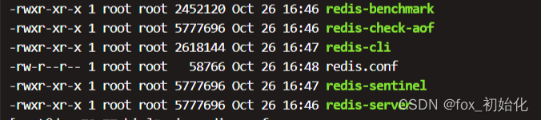

​

环境准备
执行yum install gcc-c++

输入y回车即可。

部署步骤
1. 下载安装包并解压
   在这个连接下招到你要部署的版本：Index of /releases/

我用的是4.0.14
```aidl
# wget http://download.redis.io/releases/redis-4.0.14.tar.gz

# tar -zxvf redis-4.0.14.tar.gz
```

2. 编译运行环境
```aidl
# make
```

3. 转移文件
   把redis.conf和src下的（redis-server、redis-benchmark、redis-check-aof、redis-sentinel 、redis-cli）文件复制到/usr/local/bin/下

redis-server //启动服务

redis-benchmark //测试性能

redis-check-aof //检查aof持久化文件

redis-sentinel  //哨兵

redis-cli //客户端
```aidl
# cp XXX /usr/local/bin/
```


4. 修改配置文件
进入到usr/local/bin/下修改redis.conf文件

:set nu (显示行数,或者:set number)

将第136行no 改成 yes

daemonize是用来指定redis是否要用守护线程的方式启动。

当我们采用yes时，redis会在后台运行，此时redis将一直运行，除非手动kill该进程。同时将进程pid号写入至redis.conf选项pidfile设置的文件中，默认会生成在/var/run/redis.pid，也可以通过pidfile来指定pid文件生成的位置
而采用no时，当前界面将进入redis的命令行界面，exit强制退出或者关闭连接工具(putty,xshell等)都会导致redis进程退出。
```aidl
# vim redis.conf
# :set nu
# wq
```


5. 启动redis进程
```aidl
# redis-server redis.conf
# ps -ef | grep redis
```

6. 进入redis客户端
   进入客户端后可以ping一下连通性
```aidl
# redis-cli -p 6379
127.0.0.1:6379> ping
PONG
```


7. 关闭redis服务
```aidl
# shutdown
# exit
```


​